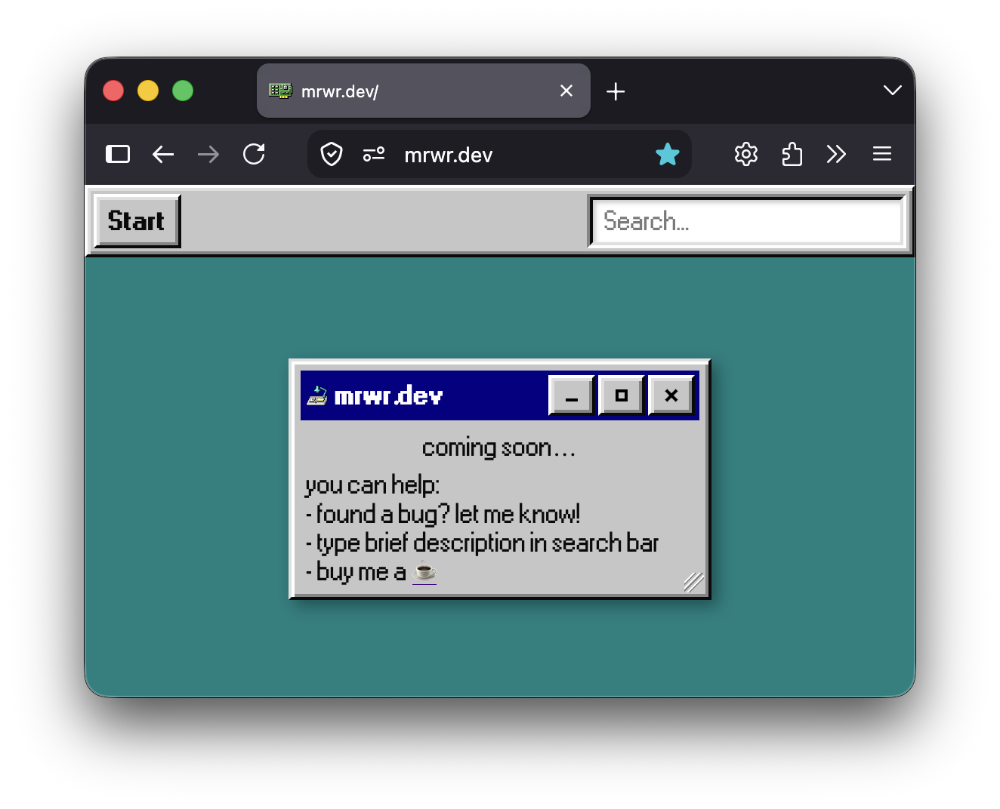

# mrwr.dev

my website
- mrwr are my initials
- dev is my profession

## credits
- built with [Next.js](https://nextjs.org/) & [React](https://react.dev/) - https://nextjs.org/ and https://react.dev/
- deployed on [DigitalOcean](https://www.digitalocean.com/) - https://www.digitalocean.com/
- ui created with [react95](https://react95.io/) - https://react95.io/
- music from [strudel.cc](https://strudel.cc) - https://strudel.cc
- fluid from [PavelDoGreat](https://github.com/PavelDoGreat/WebGL-Fluid-Simulation) - https://github.com/PavelDoGreat/WebGL-Fluid-Simulation
- trees from [Seattle GeoData](https://data-seattlecitygis.opendata.arcgis.com/) - https://data-seattlecitygis.opendata.arcgis.com/
- rats from [Seattle Public Utilities](https://www.arcgis.com/home/item.html?id=abb9584e58444baabfc03e269319167c) - https://www.arcgis.com/home/item.html?id=abb9584e58444baabfc03e269319167c
- campus from [UW Facilities GIS](https://facilities.uw.edu/services/space/gis-maps) - https://facilities.uw.edu/services/space/gis-maps
- elevation from [USGS 3DEP](https://www.usgs.gov/3d-elevation-program) - https://www.usgs.gov/3d-elevation-program
- seasons tuned to [USA-NPN](https://www.usanpn.org/) observations - https://www.usanpn.org/
- some help from [Chat GPT](https://chatgpt.com/) - https://chatgpt.com/
- and a lot of help from [Codex](https://chatgpt.com/codex/) - https://chatgpt.com/codex/
- and even more help from [Claude](https://claude.ai/) - https://claude.ai/

## file complaint
add github issue to file complaint
